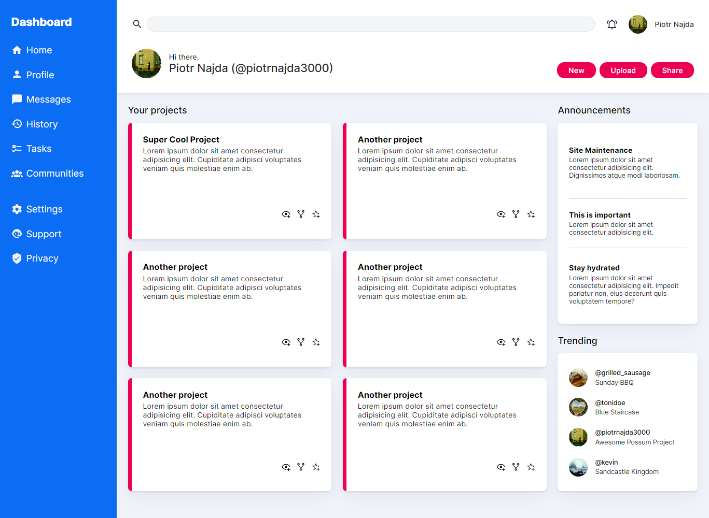

# Admin dashboard

**_[View the site](https://piotrnajda3000.github.io/admin-dashboard/)_**

[Project brief](https://www.theodinproject.com/lessons/node-path-intermediate-html-and-css-admin-dashboard)

Design given to implement:

Webpage I've implemented:

---

**Some gratitude:**

- Figma's "Tripma" project for `box-shadow` elevation variants
- Adobe Color wheel for generating the color palette
- Hopper's painting for my avatar
